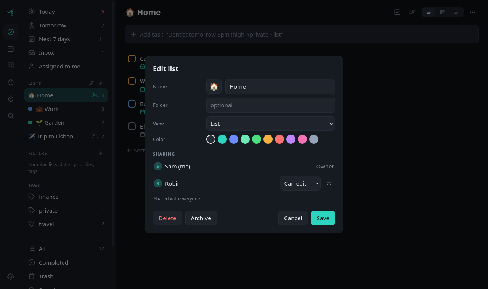
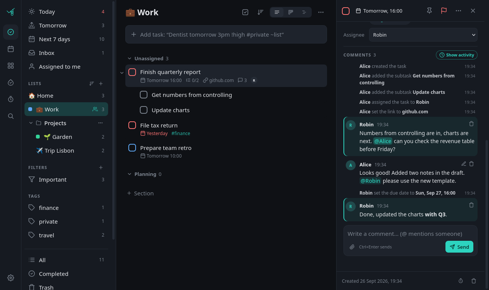

<p align="center"></p>

<h1 align="center">Abhako</h1>

<p align="center">A self-hosted task manager inspired by TickTick and Asana: personal planning meets team collaboration.<br>
Lists, calendar, Eisenhower matrix, habits, a focus timer, comments and shared lists in one small web app you run yourself.</p>

<p align="center"></p>

> **Language:** the interface is **English** by default, with **German** included (switch under *Settings > Language*); more languages are welcome, see [TRANSLATING.md](TRANSLATING.md). The name comes from the German *abhaken*, to tick off.
> Abhako is an independent hobby project and not affiliated with TickTick or Asana.

## Features

**Tasks**
- Lists with emoji and colour, list folders, sections (Kanban columns), archive
- Subtasks up to three levels, drag and drop between lists and levels
- Priorities, tags, pinned tasks, Markdown notes, attachments (images, PDFs, documents)
- A website link per task, shown as a small domain chip (paste a URL in quick add or share a page from Android)
- Natural-language quick add in English and German, whatever the interface language: `Dentist tomorrow 3pm !high #private ~Work` or `Zahnarzt morgen 15 Uhr !hoch #privat ~Arbeit`
- Recurring tasks (daily, weekdays, weekly, monthly, yearly, any RRULE) with end date, count and skip
- Smart lists (today, tomorrow, next 7 days, inbox, all), combinable filters (list, date, priority, tag)
- Multi-select with batch actions, snooze, trash with restore, search in titles, notes and links

**Views**
- Calendar (month, week, day) and a timeline, drag tasks onto days
- Eisenhower matrix (priority x due date)
- Kanban per list

**Habits and focus**
- Habits per day or *n* times per week, counters (e.g. 8 glasses of water), notes per day, streaks
- Pomodoro timer and stopwatch, focus minutes per task

**Together**
- Several users, each with their own inbox, habits, filters, tags, settings and notifications
- Share a list with others (can edit or view only); shared lists show up in their smart lists, calendar and search
- Assign tasks in shared lists: reminders go to the assignee, plus an *Assigned to me* list
- Comments on every task with @mentions and files, an activity history (who changed what, when) and unread markers
- Push notifications for new comments, mentions, assignments and completions, bundled so a busy task does not spam you
- One switch (*Collaboration*) turns all of this off for a simple personal task list
- Built-in login or single sign-on through your reverse proxy (Authelia, Authentik, oauth2-proxy)

**Everywhere**
- Installable web app (PWA) for phone and desktop, works offline: changes queue up and sync later, with conflict detection
- Mobile layout with swipe gestures, long-press drag, configurable tab bar per device
- Push notifications via [ntfy](https://ntfy.sh): reminders, focus end, habit reminders, daily digest
- Share from Android into the inbox (see below)
- Optional [Paperless-ngx](https://docs.paperless-ngx.com) integration: link documents to tasks, send attachments to Paperless
- Import TickTick CSV backups, export everything as JSON
- Dark and light theme, English and German interface (translations are plain JSON files, [add yours](TRANSLATING.md))

| | | |
|---|---|---|
|  |  |  |
| Calendar | Eisenhower matrix | Habits |

<p align="center"></p>

## Quick start

Requirements: Docker with Compose.

```sh
git clone https://github.com/Gegenschuss/abhako.git
cd abhako
cp .env.example .env        # set TZ and PUBLIC_URL at least
docker compose up -d --build
```

Abhako now listens on `http://127.0.0.1:3040`. Data (SQLite database and attachments) lives in `./data`.
Open it: the first start shows a **setup page** that creates the first account (the admin). Do this right
after installing, whoever gets there first becomes admin.

> [!IMPORTANT]
> Use HTTPS (a reverse proxy) for anything beyond your own machine: the login sends your password and
> the session cookie is only marked `Secure` behind HTTPS.

## Try it locally

No proxy needed for a quick look. After the quick start above, open **http://localhost:3040** on the same machine.
Everything works there, including installing it as an app and offline mode (browsers treat `localhost` as secure).
Push notifications, Paperless and `/drop` stay off until you configure them.

To try it from your phone or another device on your network, change the port line in `docker-compose.yml` to
`"3040:3040"`, run `docker compose up -d` again and open `http://<your-computer's-ip>:3040`. Over plain HTTP the
app works, but it cannot be installed and has no offline mode.

> [!WARNING]
> Over plain HTTP your password travels unencrypted through your network. Fine for a test at home; for daily
> use put it behind a reverse proxy with HTTPS (next section) and switch the port back.

To remove the test again: `docker compose down` and delete the folder (your test data is in `./data`).

## Users and sharing

<p align="center"></p>

- **Accounts:** admins manage users under *Settings > Users* (username, display name, optional password,
  optional SSO login, admin flag, ntfy topic, disable / delete). Everyone can change their own display name and
  password under *Settings > Account*. A user who still owns lists cannot be deleted (delete the lists or
  disable the user instead); deleting removes their inbox, habits, filters and focus history.
- **Private per user:** inbox, habits, focus sessions, filters, folders and sidebar order, tags (two people can tag
  the same shared task differently), settings (language, notifications, digest, ...), ntfy topic, upload token.
- **Sharing:** open a list's menu (*Edit list > Sharing*) and add people with *Can edit* or *View only*. Only the
  owner renames, archives, deletes or re-shares a list; members can leave. The inbox cannot be shared.
  Moving a task into a list needs edit rights there, moving it out needs edit rights on its current list;
  subtasks always follow their parent.
- **Assignment:** in shared lists a task can be assigned to the owner or a member (task panel > *Assignee*).
  Reminders go to the assignee, otherwise to whoever created the task. The daily digest contains your own
  lists' tasks plus everything assigned to you.
- **Export** (*Settings > Export*) contains your data and the lists you own (tasks with links, comments and history).

### Comments and activity

<p align="center"></p>

- **Comments:** everyone who can see a task can comment on it, including *View only* members (they still cannot
  change the task). On a private task, comments work as a personal log. Comments support a little Markdown,
  links, files (images show as thumbnails inside the comment, not in the task's attachment list) and
  **@mentions**: type `@` for a list of the people who can see the task. Mentions are stored by user, so a
  renamed user stays linked. *Ctrl+Enter* sends.
- **Edit and delete:** you can edit and delete your own comments (edited ones show *edited*, deleted ones and
  their files disappear). The owner of a list may delete any comment in it (moderation); admins have no extra
  rights on other people's comments.
- **Activity:** the task panel shows the history between the comments: created, renamed, dates, priority,
  assignment, moves, completion, repetition, links, attachments, subtasks, trash. Sort order, pins, reminders
  and your private tags are not logged. *Show activity* hides it (remembered per device).
- **Unread:** tasks with comments show a count; a dot marks comments by others you have not seen yet. Opening the
  task marks them as read.
- **Notifications** (to each person's own ntfy topic, in their language; tapping opens the task; never for your
  own actions and only to people who can still see the task):
  - new comment: to the assignee, the creator and everyone who commented before; *@mentioned* people always,
    with "mentioned you"
  - *Sam assigned you: task* to the new assignee (with list and due date), *Sam unassigned you from: task*
    to the previous one
  - *Robin completed: task* to the creator and whoever assigned it, for tasks in shared lists
  - bundling: after a push about a task, anything else on that task within a minute is collected into one
    summary push ("2 more comments · 1 more change").
- **Offline:** comments need a connection. Offline, the text stays in the box with a notice (task edits still
  queue up and sync later as before).
- **Simple mode:** *Settings > Modules > Collaboration* (per user) hides comments, activity, mentions, unread and
  assignee chips, the sharing section, the assignee field and *Assigned to me*, and stops these notifications.
  Shared lists you are in stay visible as normal lists, nothing is deleted. *Website link* is a separate switch
  for the link field and chips.

## Login

**Built-in (default):** username and password (hashed with scrypt), an HttpOnly `SameSite=Lax` session cookie
("stay logged in" = 30 days), failed logins are rate-limited per user and IP. Upgrading from the single-user
version: your data is moved to the user `admin` (or `AUTH_BOOTSTRAP_USER`); give it a password once with
`docker exec -it abhako python app.py set-password admin`.

**Single sign-on via your reverse proxy:** set `AUTH_PROXY_HEADER` (e.g. `Remote-User`) and
`AUTH_TRUSTED_PROXIES`, then enter each person's proxy user name as *SSO login* in *Settings > Users*. A logged-in
proxy user without an Abhako account sees a "no account, ask the admin" page. Without the header (or from an
untrusted address) Abhako falls back to its own login page.

> [!CAUTION]
> The header is a password: whoever can send it to Abhako is that user. Abhako only trusts it from
> `AUTH_TRUSTED_PROXIES` (the **direct** peer address), never on `/drop`, `/manifest.json` and static files, and
> your proxy **must remove client-supplied copies** before its auth step, especially on paths that bypass the login.
> With Docker port publishing every connection (your proxy, other containers, monitoring) usually arrives from the
> Docker bridge gateway address; then also set `AUTH_PROXY_PORT=3045` and publish that container port only
> on the address your proxy uses (`127.0.0.1:3040:3045`), so nothing else can reach the port that trusts the header.

**CSRF:** every state-changing API request must carry `X-Requested-With: abhako` (the app always sends it; other
sites cannot without a CORS preflight, which Abhako never allows).

## Reverse proxy

Terminate HTTPS in your proxy. If the proxy has its own login (single sign-on), put it in front of everything
except these paths:

| Path | Why it must bypass the login |
|---|---|
| `/manifest.json`, `/static/icon-192.png`, `/static/icon-512.png` | Browsers fetch these without cookies when installing the PWA. They contain no data. |
| `/drop` | Upload endpoint for share apps. Protected by each user's own bearer token. |

Example for Caddy with Authelia (single sign-on). The `route` keeps the order: first strip any client-sent
`Remote-*` headers, then let `forward_auth` set the real ones:

```caddyfile
tasks.example.com {
	route {
		request_header -Remote-User
		request_header -Remote-Groups
		request_header -Remote-Email
		request_header -Remote-Name
		@gated not path /manifest.json /static/icon-192.png /static/icon-512.png /drop
		forward_auth @gated authelia:9091 {
			uri /api/authz/forward-auth
			copy_headers Remote-User Remote-Groups Remote-Email Remote-Name
		}
		reverse_proxy 127.0.0.1:3040
	}
}
```

With the built-in login a plain `reverse_proxy 127.0.0.1:3040` is enough.

## Configuration

All settings are environment variables in `.env` (see [.env.example](.env.example)).

| Variable | Default | Purpose |
|---|---|---|
| `TZ` | `Europe/Berlin` | Time zone for due dates and reminders |
| `PUBLIC_URL` | `http://localhost:3040` | Your address, used in notification links |
| `NTFY_URL` | `https://ntfy.sh` | ntfy server for push notifications |
| `NTFY_TOPIC` | random | Topic of the first admin; every other user gets a random one (editable by admins) |
| `NTFY_TOKEN` | | Access token for a protected ntfy server |
| `AUTH_PROXY_HEADER` | | Header with the user name from an authenticating proxy (e.g. `Remote-User`); empty = built-in login only |
| `AUTH_TRUSTED_PROXIES` | | Comma list of IPs / CIDRs whose header is trusted (direct peer) |
| `AUTH_PROXY_PORT` | | Extra container port; if set, the header is only trusted on it (see *Login*) |
| `AUTH_BOOTSTRAP_USER`, `AUTH_BOOTSTRAP_NAME`, `AUTH_BOOTSTRAP_PROXY_LOGIN` | `admin` | Account that receives the data when upgrading from the single-user version |
| `AUTH_SESSION_DAYS` | `30` | Lifetime of a "stay logged in" session |
| `TASKS_DROP_TOKEN` | | Becomes the first admin's `/drop` token (every user has an own one, see *Sharing from Android*) |
| `NTFY_INBOX_URL`, `NTFY_INBOX_TOKEN`, `NTFY_INBOX_TOPIC` | | Optional share inbox: each message on this ntfy topic becomes an inbox task |
| `NTFY_INBOX_USER` | first admin | Username whose inbox receives the share inbox |
| `NTFY_INBOX_PUBLIC` | | Public ntfy URL, if attachment links use a different address than `NTFY_INBOX_URL` |
| `PAPERLESS_API`, `PAPERLESS_PUBLIC_URL`, `PAPERLESS_TOKEN` | | Paperless-ngx integration (internal API URL, URL for your browser, API token) |
| `TASKS_MAX_FILE_MB` | `50` | Maximum size per attachment (task and comment files) |
| `TASKS_PUSH_GAP` | `60` | Seconds in which further comments / changes on a task are bundled into one summary push |

Everything else (language, reminder defaults, digest time, pomodoro lengths, which modules are shown) is set per user in the app under *Settings*.

## Language

Abhako starts in **English**. Open *Settings > Language* (in German: *Einstellungen > Sprache*) to switch; **Deutsch**
is included. The choice is stored per user on the server, so it applies to all your devices and also to your push
notifications (reminders, focus end, habit reminders, daily digest) and server messages.

Each language other than English is one JSON file in [`static/i18n/`](static/i18n/) that is picked up
automatically. Want Abhako in your language? [TRANSLATING.md](TRANSLATING.md) explains how to add one in a few
steps (copy `de.json`, translate, run `python3 tools/i18n_check.py`, open a pull request).

Quick add always understands English and German, independent of this setting:

| | English | German |
|---|---|---|
| Dates | `today`, `tomorrow`, `day after tomorrow`, `friday`, `next monday`, `in 3 days`, `in 2 weeks`, `next week`, `weekend`, `12.10.` | `heute`, `morgen`, `übermorgen`, `freitag`, `nächsten montag`, `in 3 tagen`, `nächste woche`, `wochenende` |
| Times | `3pm`, `at 9:30am`, `15:00`, `at 15:00` | `15 uhr`, `um 9:30` |
| Repeat | `daily`, `every day`, `weekdays`, `weekly`, `every monday`, `every 2 weeks`, `monthly`, `yearly` | `täglich`, `werktags`, `wöchentlich`, `jeden montag`, `alle 2 wochen`, `monatlich`, `jährlich` |
| Priority | `!high`, `!medium`, `!low` (or `!!!`, `!!`, `!`) | `!hoch`, `!mittel`, `!niedrig` |
| Tag, list | `#tag`, `~list` | `#tag`, `~liste` |

Task titles, list names, tags and notes are never translated.

## Notifications

1. Install the ntfy app ([Android](https://play.google.com/store/apps/details?id=io.heckel.ntfy), [iOS](https://apps.apple.com/app/ntfy/id1625396347)).
2. Open Abhako > *Settings*: your topic is shown there (every user has an own one). Subscribe to it in the ntfy app.
3. Press *Send test*.

Besides reminders, focus end, habit reminders and the daily digest, Abhako pushes new comments, @mentions,
assignments and completions in shared lists (see *Comments and activity*; off with the *Collaboration* module).

On ntfy.sh anyone who knows the topic name can read it, so keep it random or run your own ntfy server with a token.

## Sharing from Android

Chrome currently passes no files to installed web apps via the share sheet (links and text work). Two ways around it:

**HTTP Shortcuts** (several files per share, recommended)
1. Get your personal token under *Settings > Account > Upload token* (with a login proxy, let it pass `/drop`, see above).
2. Install [HTTP Shortcuts](https://http-shortcuts.rmy.ch) and create a shortcut: method `POST`, URL `https://tasks.example.com/drop`.
3. Authentication: *Bearer token* with your token.
4. Request body: *Form data*, one parameter of type *file* named `file` with multiple files allowed. Optionally a text parameter `text` (first line = title).
5. Share images from the gallery to the shortcut: one task in *your* inbox with all files attached.

**ntfy** (one file per share): set the `NTFY_INBOX_*` variables, then share to the ntfy app on that topic.

## Backup and update

- Backup: stop the container and copy `./data` (database `tasks.db` plus `attachments/`), or use *Settings > Export* for a JSON dump.
- Update: `git pull && docker compose up -d --build`. The database schema migrates itself on start.

## Tech

Python (Flask, waitress, python-dateutil) and SQLite on the server, plain JavaScript in the browser (`app.js`, translation helpers in `i18n.js`, translations in `static/i18n/*.json`): no build step, no framework, no external requests (website links are never fetched, no favicons). Icons from [Lucide](https://lucide.dev).

## Limits

Abhako is built for one person, a household or a small team, not as a hosted service for many accounts.

- **Tasks:** every device loads all open tasks plus the last 14 days of completed ones (and a year of habit
  history) in one request and re-renders from it. A few thousand open tasks per user feel instant; around
  10,000 open tasks the payload reaches several megabytes and rendering slows down, especially on phones.
  Completed tasks older than 14 days are not loaded, so a long history costs nothing.
- **Users:** devices poll for changes every few seconds, and any change makes every active device reload its
  state. That is fine for a handful of people; with more than roughly 20 to 30 users active at the same time
  it becomes wasteful.
- **Database:** SQLite in WAL mode handles hundreds of thousands of tasks without trouble. Writes are
  serialised, which only matters under many writes per second. Attachments are stored as files, not in the
  database.

If you run into these limits, the next steps would be per-user change tracking, sending only changes
instead of the full state, and rendering long lists incrementally. Issues and pull requests are welcome.

## License

[MIT](LICENSE). Third-party notices: [THIRD_PARTY_NOTICES.md](THIRD_PARTY_NOTICES.md).
