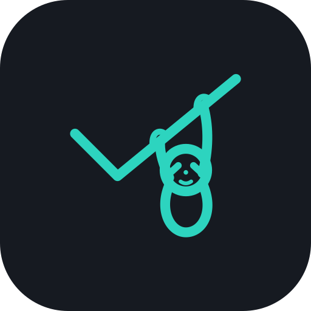
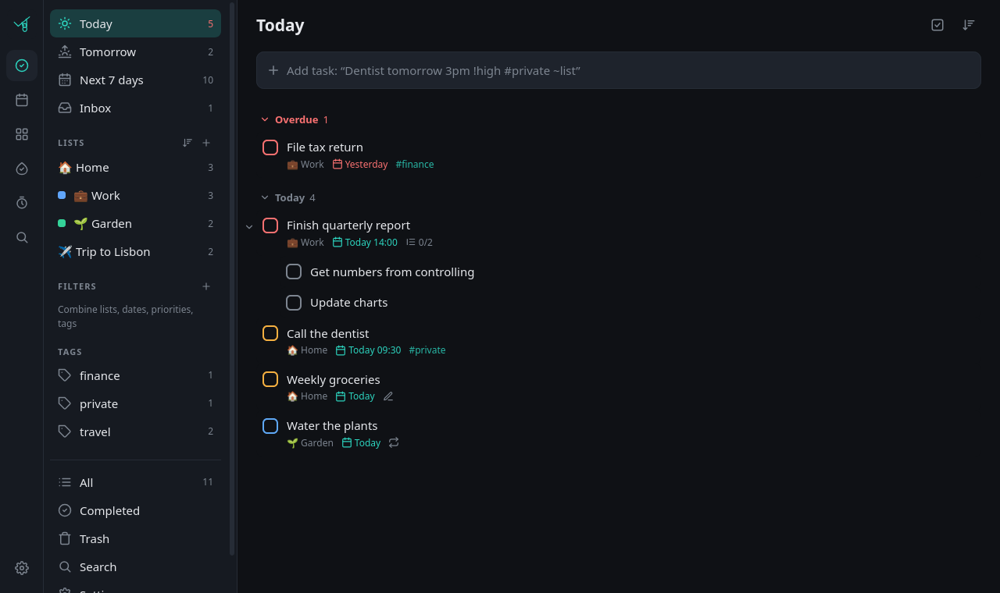
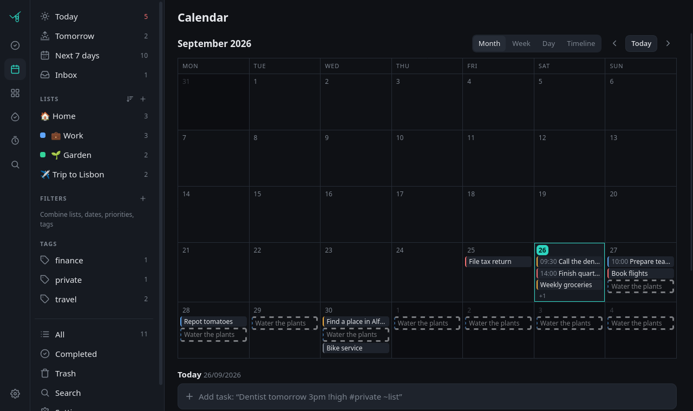
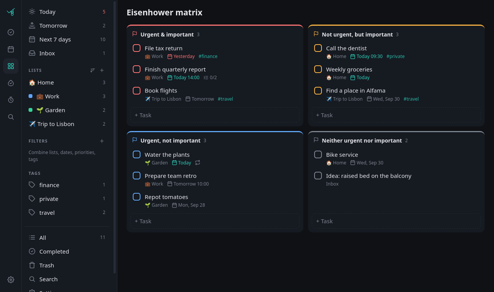
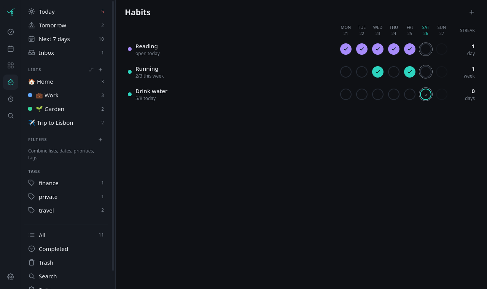
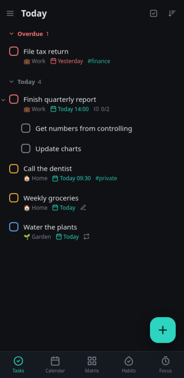

<p align="center"></p>

<h1 align="center">Abhako</h1>

<p align="center">A self-hosted task manager inspired by TickTick.<br>
Lists, calendar, Eisenhower matrix, habits and a focus timer in one small web app you run yourself.</p>

<p align="center"></p>

> **Language:** the interface speaks **English and German** (switch under *Settings > Language*). The name comes from the German *abhaken*, to tick off.
> Abhako is an independent hobby project and not affiliated with TickTick.

## Features

**Tasks**
- Lists with emoji and colour, list folders, sections (Kanban columns), archive
- Subtasks up to three levels, drag and drop between lists and levels
- Priorities, tags, pinned tasks, Markdown notes, attachments (images, PDFs, documents)
- Natural-language quick add in English and German, whatever the interface language: `Dentist tomorrow 3pm !high #private ~Work` or `Zahnarzt morgen 15 Uhr !hoch #privat ~Arbeit`
- Recurring tasks (daily, weekdays, weekly, monthly, yearly, any RRULE) with end date, count and skip
- Smart lists (today, tomorrow, next 7 days, inbox, all), combinable filters (list, date, priority, tag)
- Multi-select with batch actions, snooze, trash with restore, search in titles and notes

**Views**
- Calendar (month, week, day) and a timeline, drag tasks onto days
- Eisenhower matrix (priority x due date)
- Kanban per list

**Habits and focus**
- Habits per day or *n* times per week, counters (e.g. 8 glasses of water), notes per day, streaks
- Pomodoro timer and stopwatch, focus minutes per task

**Everywhere**
- Installable web app (PWA) for phone and desktop, works offline: changes queue up and sync later, with conflict detection
- Mobile layout with swipe gestures, long-press drag, configurable tab bar per device
- Push notifications via [ntfy](https://ntfy.sh): reminders, focus end, habit reminders, daily digest
- Share from Android into the inbox (see below)
- Optional [Paperless-ngx](https://docs.paperless-ngx.com) integration: link documents to tasks, send attachments to Paperless
- Import TickTick CSV backups, export everything as JSON
- Dark and light theme, English and German interface

| | | |
|---|---|---|
|  |  |  |
| Calendar | Eisenhower matrix | Habits |

<p align="center"></p>

## Quick start

Requirements: Docker with Compose.

```sh
git clone https://github.com/<you>/abhako.git
cd abhako
cp .env.example .env        # set TZ and PUBLIC_URL at least
docker compose up -d --build
```

Abhako now listens on `http://127.0.0.1:3040`. Data (SQLite database and attachments) lives in `./data`.

> [!IMPORTANT]
> **Abhako has no login of its own.** It is built for a single user behind an authenticating reverse proxy
> (Authelia, Authentik, oauth2-proxy, basic auth, ...) or inside a private network / VPN.
> Never expose port 3040 directly to the internet.

## Reverse proxy

Put your proxy's login in front of everything except three kinds of paths:

| Path | Why it must bypass the login |
|---|---|
| `/manifest.json`, `/static/icon-192.png`, `/static/icon-512.png` | Browsers fetch these without cookies when installing the PWA. They contain no data. |
| `/drop` | Upload endpoint for share apps (only if you set `TASKS_DROP_TOKEN`). Protected by its own bearer token. |

Example for Caddy with basic auth:

```caddyfile
tasks.example.com {
	@open path /manifest.json /static/icon-192.png /static/icon-512.png /drop
	handle @open {
		reverse_proxy 127.0.0.1:3040
	}
	handle {
		basic_auth {
			me $2a$14$...   # caddy hash-password
		}
		reverse_proxy 127.0.0.1:3040
	}
}
```

## Configuration

All settings are environment variables in `.env` (see [.env.example](.env.example)).

| Variable | Default | Purpose |
|---|---|---|
| `TZ` | `Europe/Berlin` | Time zone for due dates and reminders |
| `PUBLIC_URL` | `http://localhost:3040` | Your address, used in notification links |
| `NTFY_URL` | `https://ntfy.sh` | ntfy server for push notifications |
| `NTFY_TOPIC` | random | Topic to publish to (generated on first start if empty) |
| `NTFY_TOKEN` | | Access token for a protected ntfy server |
| `TASKS_DROP_TOKEN` | | Enables `POST /drop` (see *Sharing from Android*) |
| `NTFY_INBOX_URL`, `NTFY_INBOX_TOKEN`, `NTFY_INBOX_TOPIC` | | Optional share inbox: each message on this ntfy topic becomes an inbox task |
| `NTFY_INBOX_PUBLIC` | | Public ntfy URL, if attachment links use a different address than `NTFY_INBOX_URL` |
| `PAPERLESS_API`, `PAPERLESS_PUBLIC_URL`, `PAPERLESS_TOKEN` | | Paperless-ngx integration (internal API URL, URL for your browser, API token) |
| `TASKS_MAX_FILE_MB` | `50` | Maximum size per attachment |

Everything else (language, reminder defaults, digest time, pomodoro lengths, which modules are shown) is set in the app under *Settings*.

## Language

Open *Settings > Language* (in German: *Einstellungen > Sprache*) and pick **Deutsch** or **English**. The choice is
stored on the server, so it applies to every device and also to the push notifications (reminders, focus end,
habit reminders, daily digest) and server messages. New installs start in German.

Quick add always understands both languages, independent of this setting:

| | English | German |
|---|---|---|
| Dates | `today`, `tomorrow`, `day after tomorrow`, `friday`, `next monday`, `in 3 days`, `in 2 weeks`, `next week`, `weekend`, `12.10.` | `heute`, `morgen`, `übermorgen`, `freitag`, `nächsten montag`, `in 3 tagen`, `nächste woche`, `wochenende` |
| Times | `3pm`, `at 9:30am`, `15:00`, `at 15:00` | `15 uhr`, `um 9:30` |
| Repeat | `daily`, `every day`, `weekdays`, `weekly`, `every monday`, `every 2 weeks`, `monthly`, `yearly` | `täglich`, `werktags`, `wöchentlich`, `jeden montag`, `alle 2 wochen`, `monatlich`, `jährlich` |
| Priority | `!high`, `!medium`, `!low` (or `!!!`, `!!`, `!`) | `!hoch`, `!mittel`, `!niedrig` |
| Tag, list | `#tag`, `~list` | `#tag`, `~liste` |

Task titles, list names, tags and notes are never translated.

## Notifications

1. Install the ntfy app ([Android](https://play.google.com/store/apps/details?id=io.heckel.ntfy), [iOS](https://apps.apple.com/app/ntfy/id1625396347)).
2. Open Abhako > *Settings*: the topic is shown there. Subscribe to it in the ntfy app.
3. Press *Send test*.

On ntfy.sh anyone who knows the topic name can read it, so keep it random or run your own ntfy server with a token.

## Sharing from Android

Chrome currently passes no files to installed web apps via the share sheet (links and text work). Two ways around it:

**HTTP Shortcuts** (several files per share, recommended)
1. Set `TASKS_DROP_TOKEN` to a long random string and let your proxy pass `/drop` (see above).
2. Install [HTTP Shortcuts](https://http-shortcuts.rmy.ch) and create a shortcut: method `POST`, URL `https://tasks.example.com/drop`.
3. Authentication: *Bearer token* with your token.
4. Request body: *Form data*, one parameter of type *file* named `file` with multiple files allowed. Optionally a text parameter `text` (first line = title).
5. Share images from the gallery to the shortcut: one inbox task with all files attached.

**ntfy** (one file per share): set the `NTFY_INBOX_*` variables, then share to the ntfy app on that topic.

## Backup and update

- Backup: stop the container and copy `./data` (database `tasks.db` plus `attachments/`), or use *Settings > Export* for a JSON dump.
- Update: `git pull && docker compose up -d --build`. The database schema migrates itself on start.

## Tech

Python (Flask, waitress, python-dateutil) and SQLite on the server, plain JavaScript in the browser (`app.js` plus the translations in `i18n.js`): no build step, no framework, no external requests. Icons from [Lucide](https://lucide.dev).

## License

[MIT](LICENSE). Third-party notices: [THIRD_PARTY_NOTICES.md](THIRD_PARTY_NOTICES.md).
